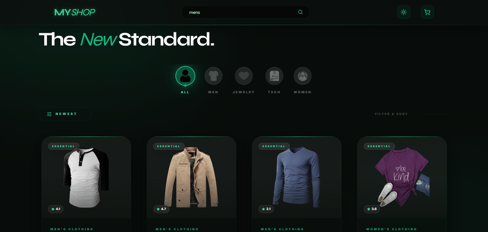
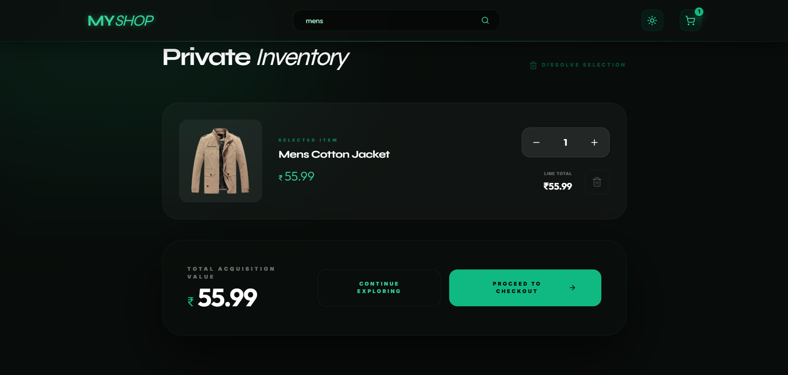
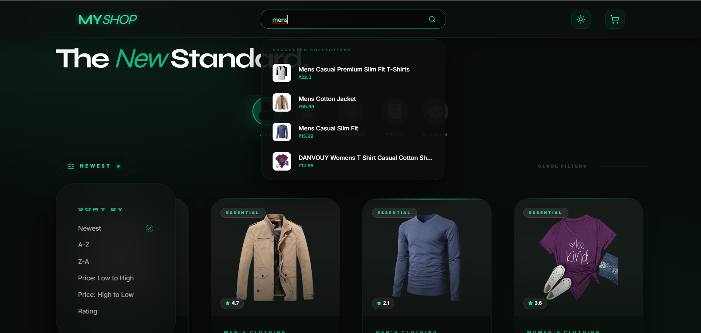

# FAke API v0

A modern e-commerce web app with product browsing, search, and cart management.

## Description

FAKe API v0 is a responsive shopping application that connects to a product API and lets users browse, search, filter, and manage items in a cart. Its main purpose is to provide a fast and intuitive online shopping experience for users.

## Features

- Browse products by category
- Search products by name
- Add and remove items from cart
- Update product quantities
- Responsive layout for desktop and mobile

## Tech Stack

- React
- Vite
- JavaScript
- CSS
- Fake Store API

## Installation

1. Clone the repository.
2. Install dependencies:

```bash
npm install
```

3. Start the development server:

```bash
npm run dev
```

## Usage

Open the local development URL shown in the terminal after running the app. Browse products, use search and filters to find items, then add selected products to the cart for review.

## Folder Structure

```
src/
  components/
  utils/
  assets/
  App.jsx
  main.jsx
  index.css
```

## Screenshots

### Home Page



### Cart Page



### Search Feature



## Future Improvements

- Add user authentication
- Add product detail pages
- Add checkout flow
- Improve product filtering options

## Author

Abinash Rout (JILU)
